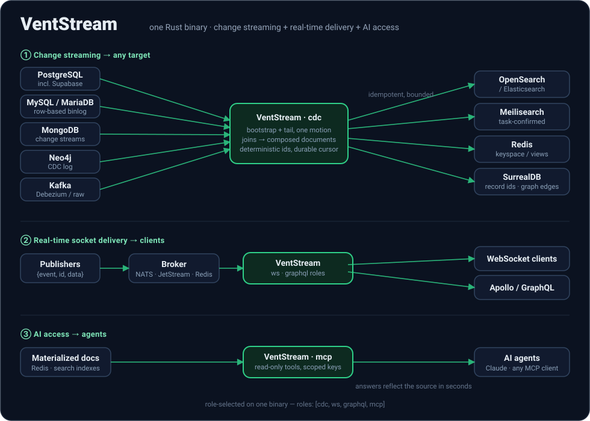

<p align="center">
  
</p>

<p align="center">
  <b>Sync your database into search, caches, SurrealDB, and your AI's context — joined, current, one binary.</b>
</p>

<p align="center">
  <a href="https://github.com/ventstream/ventstream/releases"></a>
  <a href="https://github.com/ventstream/ventstream/actions/workflows/ci.yml"></a>
  <a href="LICENSE"></a>
  <a href="https://ventstream.dev/docs"></a>
</p>

<p align="center">
  
</p>

VentStream captures changes from PostgreSQL, Supabase, MySQL/MariaDB, MongoDB,
Neo4j, or Kafka, optionally runs stateful denormalizing joins, and materializes
documents into OpenSearch/Elasticsearch, Meilisearch, Redis, or SurrealDB —
idempotent, crash-safe, and typically current within a second. The same engine
fans events out to browsers over native WebSockets and Apollo-compatible
GraphQL subscriptions, and serves the materialized documents to AI agents over
MCP.

One public artifact runs everywhere: standalone against a local config file,
or attached to [VentStream Cloud](https://ventstream.dev) with a single agent
key.

---

## See it live

- **[surreal-demo.ventstream.dev](https://surreal-demo.ventstream.dev)** —
  Postgres orders joined with their customer, streaming into SurrealDB with
  the sync latency measured live. Click a card, watch the document change.
- **[MCP live demo](https://ventstream.dev/docs/demos/mcp-live)** — point
  Claude at `https://mcp-demo.ventstream.dev/mcp` with the published demo key
  and query a continuously-updated index in chat.

Both run this repo's published images, managed by
[VentStream Cloud](https://ventstream.dev). More at
[ventstream.dev/docs/demos](https://ventstream.dev/docs/demos/overview).

---

## Contents

- [Why VentStream](#why-ventstream)
- [Sources and targets](#sources-and-targets)
- [Quickstart](#quickstart)
- [A minimal pipeline](#a-minimal-pipeline)
- [Joined documents](#joined-documents)
- [Managed mode](#managed-mode)
- [Real-time delivery](#real-time-delivery)
- [AI access over MCP](#ai-access-over-mcp)
- [Performance](#performance)
- [Deploy](#deploy)
- [Configuration reference](#configuration-reference)
- [Repository layout](#repository-layout)
- [Engineering bar](#engineering-bar)
- [Development](#development)
- [License](#license)

---

## Why VentStream

Two pipelines off one event core, run together or apart
(`roles: [cdc, ws, graphql]`):

1. **Change streaming → any target.** Capture inserts, updates, and deletes at
   the source and stream them continuously into search indexes and caches.
   Every document carries a deterministic id, so re-emits overwrite instead of
   duplicating and deletes always find their target. The cursor only advances
   after the sink confirms a durable write — crash anywhere, resume exactly
   where you left off, no gaps, no duplicates.
2. **Real-time socket delivery → clients.** Publishers emit events to NATS or
   Redis Streams; VentStream pushes them to subscribed clients over a native
   WebSocket protocol and GraphQL subscriptions (`graphql-transport-ws`,
   Apollo-compatible), with typed subscriptions authored in GraphQL SDL.

What that buys you in practice:

- **Joined, not just mirrored.** Declare parent + children in a YAML spec and
  the sink receives one composed document per logical row — orders with their
  items and customer embedded — kept current as any side changes, including
  child deletes and fan-out updates.
- **Exactly-the-right-rows.** Postgres publications, MySQL binlog filters,
  Mongo collection scopes: the database owner decides what leaves the
  database.
- **Bootstrap + tail, one motion.** A keyset-paginated snapshot seeds the
  target, then the live tail takes over from the exact watermark — same
  document shapes, same ids.
- **One-time migration too.** Not every copy needs to live forever: bootstrap
  at bulk speed, let the tail catch up so mid-copy writes are included, stop —
  a complete, consistent copy that resumes where it left off if interrupted.
  See the [one-time migration guide](docs-site/guides/one-time-migration.mdx).
- **Fail closed.** Undeliverable events block the cursor rather than being
  silently dropped; poison events go to a JSONL dead-letter queue with the
  reason attached.

## Sources and targets

| | Source | Mechanism |
|---|---|---|
| ✅ | PostgreSQL | logical replication (pgoutput) |
| ✅ | Supabase | logical replication, pooler/IPv6-aware preflight |
| ✅ | MySQL / MariaDB | row-based binlog |
| ✅ | MongoDB | change streams |
| ✅ | Neo4j 5.17+ Enterprise | CDC log with `txLogEnrichment` |
| ✅ | Kafka / Redpanda | Debezium envelopes or raw topics |

| | Target | Notes |
|---|---|---|
| ✅ | OpenSearch / Elasticsearch | bulk API, external versioning |
| ✅ | Meilisearch | task-confirmed writes, FIFO ordering |
| ✅ | Redis | keyspace or view materialization, cluster-aware |
| ✅ | SurrealDB | CBOR-native RPC, real record ids, optional graph edges |
| ✅ | Browsers | native WebSocket + GraphQL subscriptions |
| ✅ | AI agents | read-only MCP server over materialized documents |

The engine is source/sink-pluggable; this is the matrix that is built and
tested end to end today.

## Quickstart

**Self-contained demo** — Postgres and Neo4j sources, OpenSearch target,
seeded e-commerce data, joined documents streaming end to end. No Rust
toolchain needed; it pulls the published image:

```bash
git clone https://github.com/ventstream/ventstream
cd ventstream/demo/stack && docker compose up -d
# follow demo/stack/README.md — insert an order, watch the joined
# document appear in OpenSearch in real time
```

**Install the binary** — checksum-verified Linux, macOS, and Windows builds:

```bash
curl -fsSL https://ventstream.dev/install.sh | sh
```

Windows (PowerShell; every connector except the Kafka source):

```powershell
irm https://ventstream.dev/install.ps1 | iex
```

**Or pull the image**:

```bash
docker pull ghcr.io/ventstream/ventstream:<version>
```

## A minimal pipeline

Point the engine at a Postgres publication and an OpenSearch endpoint —
nothing else. Table selection lives in the publication
(`CREATE PUBLICATION vs_pub FOR TABLE orders`), and every document gets a
deterministic id derived from its primary key:

```yaml
# ventstream.yaml — non-secret; credentials are env: references
schema_version: 1
roles: [cdc]

source:
  kind: postgres
  postgres:
    host_ref: env:VS_PG_HOST
    user_ref: env:VS_PG_USER
    password_ref: env:VS_PG_PASSWORD
    database_ref: env:VS_PG_DATABASE
    publication_ref: env:VS_PG_PUBLICATION
    slot_ref: env:VS_PG_SLOT
    bootstrap:
      mode: snapshot

sink:
  kind: opensearch
  opensearch:
    endpoint_ref: env:VS_OS_ENDPOINT
    index_routing:
      strategy: fixed
      name: orders
```

```bash
VS_ENGINE_CONFIG=./ventstream.yaml ventstream
```

Inserts, updates, deletes — even primary-key changes — stay in exact lockstep
with the table. Swap the sink block for `meilisearch`, `redis`, or `surrealdb` and the same
pipeline targets those instead.

## Joined documents

When flat rows aren't enough, declare the shape you want in a joins spec and
pick a denormalize mode. The sink then receives composed documents that are
recomputed whenever any contributing row changes:

```yaml
# joins.yaml
joins:
  - name: orders
    primary: { table: public.orders, pk: id }
    related:
      - id: customer
        table: public.customers
        pk: id
        join_on: { from: customer_id, to: id }
        embed_as: customer
        cardinality: one
      - id: items
        table: public.order_items
        pk: id
        join_on: { from: id, to: order_id }
        embed_as: items
        cardinality: many
    target: { index: orders }
```

Two engines are available: in-memory joins with redb-persisted state, or
SQL-recomposition (`denormalize_mode: sql`) that rebuilds documents with a
query against the source — the right default for large tables.

## Managed mode

The binary above is the whole product — there is no separate "managed engine".
Whether an engine is managed is decided at runtime by one credential: an agent
key minted from the [VentStream Cloud](https://ventstream.dev) dashboard or
`ventstreamctl`.

- **Key present** (`VS_AGENT_KEY`, or `managed.agent_key_ref` in the config
  file): the engine performs an invisible first-connect handshake, then fetches
  its pipeline's selected configuration revision from the control plane,
  reports health, and executes operations. Lost state simply re-binds on the
  same key.
- **Key absent**: the engine reads its local `ventstream.yaml` and **never
  opens a connection to the platform** — no telemetry, no version checks,
  nothing. This is an invariant, not a default.

```bash
# the same binary, attached to the control plane
VS_AGENT_KEY=vsa1.… ventstream
```

Config authorship stays with you either way: managed pipelines are authored as
immutable revisions with `ventstreamctl`, and credentials never transit the
platform — config documents carry `env:` references only. See
[Managed mode](docs-site/concepts/managed-mode.mdx) and the
[Kubernetes deploy guide](docs-site/deploy/kubernetes-managed-engine.mdx).

## Real-time delivery

Run the `ws` and `graphql` roles (standalone or alongside `cdc`) to push
events to browsers:

- Native WebSocket protocol with per-connection mailboxes, slow-consumer
  eviction, and optional JetStream-backed replay
- GraphQL subscriptions over `graphql-transport-ws`, typed via SDL
  (`@vsSubscribe` / `@source`), Apollo-compatible
- NATS Core, NATS JetStream, or Redis Streams as the broker

A TypeScript SDK and example apps live in [`packages/`](packages/).

## AI access over MCP

The documents VentStream materializes are exactly what an LLM needs as
context — composed, current, and queryable. `ventstream mcp` serves them
read-only over the Model Context Protocol:

- `list_targets` / `get_entity` / `search` / `scan` tools over any Redis,
  OpenSearch/Elasticsearch, or Meilisearch target, reading through the write
  path's own key/index encoders
- stdio for local agents, or stateless Streamable HTTP with bearer keys —
  per-key target scoping, where out-of-scope means nonexistent
- answers reflect the source database within seconds, not a stale export

```bash
ventstream mcp generate-token   # mint a vsk_ key
VS_ROLES=mcp ventstream         # or run it as a managed role
```

See the [MCP server guide](docs-site/guides/mcp-server.mdx) or try the
[live endpoint](https://ventstream.dev/docs/demos/mcp-live) against a real
streaming index.

## Performance

Benchmarked end to end on 2 vCPUs / 1 GiB — every run verified for exact
document counts, zero gaps, zero duplicates
([`benchmarks/container-matrix/`](benchmarks/container-matrix/)):

| Path | Throughput |
|---|---|
| PostgreSQL → OpenSearch | 58k events/s |
| MongoDB → OpenSearch | 73k events/s |
| Kafka → OpenSearch | 88k events/s |

Four-million-document bootstrap runs land in minutes on commodity hardware,
with engine CPU staying in the low double digits and memory bounded by
explicit knobs — see [performance](docs-site/concepts/performance.mdx) for the
sizing math.

## Deploy

| Mode | How |
|---|---|
| Native binary | `install.sh`, systemd or anything else — [guide](docs-site/deploy/native-binary.mdx) |
| Docker / Compose | `ghcr.io/ventstream/ventstream:<version>` |
| Kubernetes, standalone | manifests in the [standalone guide](docs-site/deploy/kubernetes-standalone.mdx) |
| Kubernetes, managed | `oci://ghcr.io/ventstream/charts/ventstream-engine` with an agent-key Secret — [guide](docs-site/deploy/kubernetes-managed-engine.mdx) |
| Realtime gateway | `oci://ghcr.io/ventstream/charts/ventstream-gateway` |

Tagged releases publish multi-architecture images; production values should
pin `image.digest=sha256:…`. Per-platform SPDX SBOMs, vulnerability reports,
and checksums are attached to each GitHub release — see
[`docs/releasing.md`](docs/releasing.md) for the verification policy.

## Configuration reference

Everything is driven by one non-secret `ventstream.yaml`
(`VS_ENGINE_CONFIG=…`); credentials are always `env:` or `file:` references,
never inline. The complete, authoritative reference — every source, sink,
joins, realtime, TLS, and performance knob — lives in the docs:

- [Engine configuration contract](docs/engine-config-contract.md)
- [Full variable reference](docs-site/reference/engine-env.mdx)
- [Connector guides](docs-site/connectors/overview.mdx)

Read the docs locally with no account or hosting:

```bash
npm i -g mint && cd docs-site && mint dev   # → http://localhost:3000
```

## Repository layout

```
crates/
├── ventstream/             Binary — CLI, role wiring, lifecycle, managed-mode dispatch
├── ventstream-core/        Event type, bus, shutdown, canonical doc ids
├── ventstream-config/      ventstream.yaml parsing & validation
├── ventstream-sources/     Postgres, MySQL, MongoDB, Neo4j, Kafka
├── ventstream-sinks/       OpenSearch/Elasticsearch, Meilisearch, Redis
├── ventstream-joins/       Stateful joins / denormalization (redb-persisted)
├── ventstream-ws/          Native WebSocket gateway
├── ventstream-graphql/     GraphQL subscription gateway
├── ventstream-realtime/    Broker-neutral session/cursor contract
├── ventstream-managed/     Agent-key managed-mode harness
└── …                       protocol, redis, jetstream, telemetry
packages/                   TypeScript SDK, client, example apps
demo/                       Runnable demos — CDC stack, realtime, webapp
docs-site/                  Published docs (Mintlify)
infra/                      Helm charts, Docker images, k8s manifests
```

## Engineering bar

- `unsafe_code = "forbid"` across the workspace
- Clippy `pedantic` + `nursery`, with `unwrap` / `panic` / `todo` denied
- Every spawned task is owned and cancellable; message passing is the primary
  concurrency model
- Correctness is verified live, not assumed: bootstrap parity, delete
  topologies, crash-resume, and memory limits are exercised against real
  databases in CI and release gates

## Development

```bash
cargo fmt --all
cargo clippy --workspace --all-targets -- -D warnings
cargo test --workspace
```

Contributions welcome — see [CONTRIBUTING.md](CONTRIBUTING.md) and
[SECURITY.md](SECURITY.md).

---

If VentStream is useful to you, **a star helps other people find it** — and
tells us which problems to keep solving. To run it with a control plane,
dashboards, and managed pipelines, there's [VentStream Cloud](https://ventstream.dev).

## License

Apache-2.0. See [LICENSE](LICENSE).
