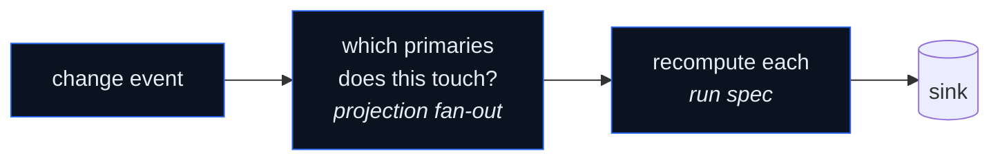

A VentStream pipeline has two halves: **capture** (read the source's
change stream) and **project** (turn each change into the documents it
affects). This page explains both and how they meet.

## Capture

VentStream reads the source's native change feed — not a polling diff.

### Postgres

Logical replication via the in-tree `pgoutput` plugin. You create a
**publication** listing the tables to stream and the engine consumes a
**replication slot**. Every insert/update/delete on a published table
arrives as a typed event with a WAL position (LSN) as its cursor.

```sql
CREATE PUBLICATION ventstream_shop
  FOR TABLE shop.orders, shop.customers, shop.order_items;
```

<Warning>
A replication slot is **single-consumer**. Exactly one agent reads a
given slot. Pointing two agents at one slot is undefined behavior —
give each agent a unique `VS_PG_SLOT`.
</Warning>

### Neo4j

Neo4j CDC via the `db.cdc.query` procedures. The engine polls the change feed
on an interval and persists an opaque cursor string. Use a Neo4j Enterprise
release or AuraDB tier that provides `db.cdc.*`; the
[Neo4j source guide](/connectors/sources/neo4j) covers the current deployment
requirements.

```cypher
ALTER DATABASE neo4j SET OPTION txLogEnrichment 'DIFF';
```

`DIFF` is recommended for projections (lighter transaction log, same result —
the engine re-queries the graph to build each document). `FULL` is only needed
for a raw CDC tail that ships full per-event state. See
[Neo4j source → `DIFF` vs `FULL`](/connectors/sources/neo4j#diff-vs-full-enrichment).

## Project

A projection spec is **optional**. With no joins or denormalize spec at all,
every change flows through as a flat per-row document with a deterministic id
(`{schema.table}:["pk",…]` — see
[deterministic document IDs](/concepts/architecture#deterministic-document-ids)):
updates overwrite the document in place, deletes remove it, and a
primary-key-changing update removes the old document and writes the new one.
Reach for a spec when you want **composed** documents — a parent with embedded
children — not for correctness.

A **projection spec** (YAML) declares the target document. The engine
uses it three ways:

1. **Bootstrap** — derive the initial scan that seeds every existing
   primary into the sink.
2. **Fan-out** — on each change, find the affected primaries and
   recompute their documents.
3. **Delete** — when a primary disappears, emit a sink delete for its
   document.

### Postgres: joins

The Postgres spec embeds related rows into the primary's document:

```yaml
joins:
  - name: orders
    primary:
      table: shop.orders
      pk: order_id
    related:
      - id: customer
        table: shop.customers
        pk: customer_id
        join_on: { from: customer_id, to: customer_id }
        embed_as: customer       # one customer object on each order
        cardinality: one
      - id: items
        table: shop.order_items
        pk: item_id
        join_on: { from: order_id, to: order_id }
        embed_as: items          # array of line items on each order
        cardinality: many
```

A change to `orders`, `customers`, or `order_items` recomputes the
affected order documents. A `cardinality: one` related row embeds as an
object; `many` embeds as an array.

### Neo4j: denormalize specs

The Neo4j spec is Cypher. You write the body that, given a primary node
`p`, returns the document; the engine wraps it with the fan-out anchor:

```yaml
denormalize:
  - primary_label: Product
    output_table: products_denormalized
    fan_out_max_hops: 2
    cypher: |
      OPTIONAL MATCH (p)-[:IN_CATEGORY]->(cat:Category)
      OPTIONAL MATCH (p)-[:SUPPLIED_BY]->(sup:Supplier)-[:LOCATED_IN]->(reg:Region)
      RETURN elementId(p) AS primaryEid, {
        elementId: elementId(p),
        name:      p.name,
        category:  cat.name,
        region:    reg.name
      } AS doc
```

`fan_out_max_hops` bounds how far a change can be from a Product and
still recompute its document. A change to a node 3 hops away when the
cap is 2 simply isn't reached.

## Where capture meets project

The join engine sits between the source and the sink. On each event:



For Postgres the "which primaries" step uses an in-memory reverse index
of foreign keys. For Neo4j it's a Cypher query anchored on the changed
element's ID. Either way, **only affected primaries are recomputed** —
see [Fan-out](/concepts/fan-out) for how that stays bounded even when a
change touches a shared lookup node.

## The scoping rule

A change propagates to the sink **only if** it lies on a path the spec
actually declares, within the hop limit, and (for temporally-gated
Neo4j edges) satisfies the spec's `WHERE`. A node whose label the spec
never traverses produces zero recomputations — the event is read and
discarded.

This is the contract: the spec is the boundary. Nothing outside it can
cause a write, which is exactly what keeps the index clean and the
fan-out bounded. (In a flat pipeline with no spec, the source scope — the
Postgres publication, the collection or table list, the topic set — is the
boundary instead.)
