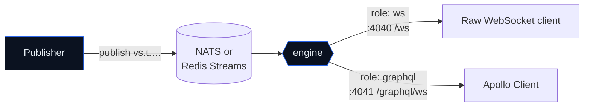

Alongside the CDC pipeline (source → denormalized documents), VentStream
runs a second, independent pipeline: **real-time data delivery**. Applications
publish events to NATS or Redis Streams; the engine fans them out to subscribed clients in
real time over two transports — a **native WebSocket** protocol and
**GraphQL subscriptions** (`graphql-transport-ws`, Apollo-compatible).



One engine binary runs both gateways — select them with
`VS_ROLES=ws,graphql` (either alone is fine too). This path shares
nothing with the CDC source/sink; it's a separate role on the same
binary.

<Note>
**Try it:** the [real-time demo (GraphiQL)](/guides/realtime-demo) brings
up NATS + the gateways in one `docker compose up` and lets you watch typed
subscriptions update live in the browser — including an optional command
that streams a changing event every second.
</Note>

## The event model

### Subjects

Events are addressed by `event` + `id` — the event **name** and the
**instance id**, with the id last:

```text
vs.t.<tenant>.<event>.<id>
# e.g.  vs.t.acme.orderStatusChanged.order_123
#       vs.t.acme.orders.order.statusChanged.order_123   (event may be dotted)
```

- `<event>` is the event name — one or more segments, mixed case allowed
  (`orderStatusChanged`, `orders.order.statusChanged`).
- `<id>` is always the **last** segment, so a single instance is directly
  addressable and the whole event class is wildcard-able.

Clients subscribe with the **tenant-relative** part — the gateway anchors
`vs.t.<tenant>.` for them, so one tenant can never receive another's
events:

```text
orderStatusChanged.order_123   # one instance
orderStatusChanged.*          # every instance of this event
orderStatusChanged.>          # everything under it
```

### Envelope

Every event is a small envelope (the `data` field is opaque JSON you
define; `actor`/`metadata` are optional):

```json
{
  "id": "01ARZ3…",                  // ULID — this event instance
  "event": "orderStatusChanged",           // the event name
  "tenant": "acme",
  "entity_id": "order_123",          // the instance id (subject's last segment)
  "occurred_at": "2026-01-01T00:00:00Z",
  "received_at": "2026-01-01T00:00:00Z",
  "schema_version": 2,
  "data": { "status": "active" },   // opaque, optional
  "actor": { "kind": "user", "id": "u_456" },  // optional
  "metadata": { "trace_id": "…" }              // optional
}
```

## Publishing

Publishers send the full envelope to an anchored broker subject. With the NATS
CLI:

```bash
nats pub vs.t.acme.orderStatusChanged.order_123 \
  '{"id":"01ARZ3NDEKTSV4RRFFQ69G5FAV","event":"orderStatusChanged","tenant":"acme","entity_id":"order_123","occurred_at":"2026-01-01T00:00:00Z","received_at":"2026-01-01T00:00:00Z","schema_version":2,"data":{"status":"active"},"metadata":{}}'
```

The event name and entity ID form the final subject segments. The envelope must
use the same tenant, event name, and entity ID as the subject. Generate a fresh
ULID for every event and set `received_at` when publishing. Publisher services
should derive the tenant from their authenticated workload context rather than
accepting it from an end user.

The repository contains `PublishInput` in `ventstream-protocol` as a reference
for building the envelope. No VentStream npm publisher package is distributed
in the current release. For Redis, append the same envelope to the tenant stream
using the [Redis wire contract](/concepts/realtime-brokers#redis-wire-contract).

## Subscribing

<Tabs>
  <Tab title="Apollo Client (GraphQL)">
    The GraphQL gateway speaks `graphql-transport-ws`, so the standard
    Apollo subscription link works unchanged. Auth + tenant travel in the
    connection-init payload:

    ```ts
    import { createClient } from "graphql-ws";
    import { GraphQLWsLink } from "@apollo/client/link/subscriptions";

    const wsLink = new GraphQLWsLink(createClient({
      url: "ws://localhost:4041/graphql/ws",
      connectionParams: { authToken: "…", tenant: "acme" },
    }));
    ```

    A generic `events(subject:)` field is always available:

    ```graphql
    subscription {
      events(subject: "orderStatusChanged.*") {
        id event entityId subject occurredAt
        data
      }
    }
    ```

    With a [subscriptions manifest](#typed-graphql-subscriptions) you also
    get **typed** fields (e.g. `orderStatusChanged(orderId:)`) that Apollo codegen
    turns into fully-typed hooks.
  </Tab>

  <Tab title="Raw WebSocket">
    The native gateway is a small JSON protocol on `/ws` — lighter than
    GraphQL when you just want a stream. The client opens the socket,
    sends `hello`, then `subscribe`:

    ```jsonc
    // → client sends
    { "type": "hello", "tenant": "acme", "token": "…" }
    // ← server
    { "type": "ready", "connection_id": "01ARZ3…" }

    // → client
    { "type": "subscribe", "id": "sub1", "pattern": "orderStatusChanged.*" }
    // ← server
    { "type": "subscribed", "id": "sub1", "anchored_pattern": "vs.t.acme.orderStatusChanged.*" }

    // ← server, on each matching event
    { "type": "event", "subject": "vs.t.acme.orderStatusChanged.order_123",
      "matched": ["sub1"], "event": { /* envelope */ } }
    ```

    Production clients should implement reconnect, subscription replay, and
    checkpoint persistence. Endpoint: `ws://localhost:4040/ws`.
  </Tab>
</Tabs>

## Typed GraphQL subscriptions

To expose **typed** fields instead of only the generic `events(subject:)`,
declare them in a **GraphQL SDL file** (`VS_GRAPHQL_SCHEMA=…`) — the
recommended way. Annotate each field with `@vsSubscribe(subject:)` (the
event it maps to, id last); the friendly `{argName}` placeholder is
filled from the field's args. Return the built-in `Event` (opaque
envelope) or a custom type whose fields take an optional `@source(from:)`
(default `$data.{field}`):

```graphql
type Subscription {
  "Opaque envelope — read data client-side"
  orderEvents(orderId: ID!): Event!
    @vsSubscribe(subject: "orderStatusChanged.{orderId}")

  "Flattened, typed view"
  orderStatusChanged(orderId: ID!): OrderStatusChange!
    @vsSubscribe(subject: "orderStatusChanged.{orderId}")
}

type OrderStatusChange {
  id: ID!             @source(from: "$event.entityId")
  status: String!     # defaults to $data.status
  changedAt: DateTime @source(from: "$event.occurredAt")
}
```

Source expressions: `$data.PATH` (from the event's opaque `data`),
`$event.FIELD` (envelope field: `id`, `tenant`, `event`, `entityId`,
`occurredAt`, `receivedAt`, `subject`), `{argName}` (a subscription
argument). The generic `events(subject:)` field stays available alongside
the typed ones.

How each kind resolves:

- **`$event.FIELD`** reads the envelope from a fixed field set, and either
  casing works — `$event.entityId` and `$event.entity_id` are the same field.
  (The envelope is snake_case on the wire; camelCase just matches the GraphQL
  side.)
- **`$data.PATH`** is an exact dot-path into the opaque `data` JSON. Keys are
  matched **character-for-character** — write them exactly as you publish them
  (`$data.user_name` for a `user_name` key), since the gateway never transforms
  `data`. A path that doesn't match resolves to `null`.
- **Omitting `@source`** defaults to `$data.{fieldName}` — the GraphQL field
  name used verbatim as the `data` key. So name a field to match its `data`
  key and it needs no `@source`; set one explicitly when they differ (e.g. a
  camelCase field `userName` over a snake_case key, `@source(from:
  "$data.user_name")`).

<Note>
The same model can be authored as a YAML manifest via
`VS_GRAPHQL_SUBSCRIPTIONS` (the legacy alternative), and an `entity_ref`
return type emits a Federation v2 reference the router stitches with the
owning subgraph. Set `VS_GRAPHQL_PLAYGROUND=1` to browse it all in an
in-browser GraphiQL at `/graphiql`.
</Note>

## Reading a subscription as its publish contract

The gateway doesn't constrain publishers — but a typed subscription **is**
the publish contract, read in reverse. Everything a publisher must send is
right there in the SDL: the `@vsSubscribe` subject tells you *where* to
publish, and the `@source` expressions tell you *which fields the event
must carry*. Read it like this:

Take `orderStatusChanged` above:

```graphql
orderStatusChanged(orderId: ID!): OrderStatusChange!
  @vsSubscribe(subject: "orderStatusChanged.{orderId}")

type OrderStatusChange {
  id: ID!             @source(from: "$event.entityId")
  status: String!     # defaults to $data.status
  changedAt: DateTime @source(from: "$event.occurredAt")
}
```

| What the subscription reads | Where it comes from | What the publisher does |
|---|---|---|
| `@vsSubscribe(subject: "…{orderId}")` | routing subject | publish `event: "orderStatusChanged"`, `id` = the order id |
| `$event.entityId` | envelope `entity_id` | set it to the order ID |
| `$event.occurredAt` | envelope `occurred_at` | set it to the business event time |
| `$data.status` | the opaque `data` | **must include `status` in `data`** |

So the **rule of thumb**: the `data` you must publish = the set of
`$data.*` paths the subscription reads (here, just `status`). Everything
else is envelope-supplied.

Any NATS client works. Build the full envelope and publish it to the composed
subject:

```jsonc
// subject: vs.t.acme.orderStatusChanged.order_1
{
  "id": "01ARZ3NDEKTSV4RRFFQ69G5FAV",   // a fresh 26-char ULID per event
  "received_at": "2026-01-01T00:00:00Z",
  "schema_version": 2,
  "event": "orderStatusChanged",
  "tenant": "acme",
  "entity_id": "order_1",
  "occurred_at": "2026-01-01T00:00:00Z",
  "data": { "status": "confirmed" }
}
```

An invalid ULID or unsupported schema version is rejected during decoding.
Routing follows the broker subject, so publishers must keep the subject and
envelope fields consistent.

The `orderEvents(orderId:) : Event!` variant reads nothing from `data`
(it hands the whole envelope back), so its only requirement is the same
subject — the `data` shape is entirely up to you.

This stays a **convention**, not enforcement: if you omit `status`, the
publish still succeeds and the subscriber's `status` resolves null (or
errors only if the SDL marked it non-null). Keeping publisher and
subscriber in agreement is what the SDL documents.

## Delivery providers

| Mode | Enable | Semantics | Use when |
|------|--------|-----------|----------|
| **Core** | default (`VS_WS_JETSTREAM` unset) | at-most-once, no history; central NATS subscriber fans to all connections | high connection density, no replay needed |
| **JetStream** | `provider: nats_jetstream` or `VS_WS_JETSTREAM=1` | at-least-once per active consumer; native WebSocket connection cursors and GraphQL operation cursors; resumable within retention | replayable delivery on NATS |
| **Redis Streams** | `provider: redis_streams` | shared tenant tailer plus filtered replay sessions; resumable within retention | Redis is already the operational broker standard |

In JetStream mode the **ws role bootstraps the stream** that the GraphQL
role reads from, so running `VS_ROLES=ws,graphql` with
`VS_WS_JETSTREAM=1` is the usual pairing.

### The stream is a self-bounding buffer

Subscribers default to live-only (`New`); a client can **resume** events it
missed on reconnect by sending a cursor (see [Resuming after a
disconnect](#resuming-after-a-disconnect)) — but only as far back as the
buffer still holds. So the stream isn't a durable log; it's a short **live +
resume buffer**. The engine creates it with self-bounding limits so it can't
grow without bound and needs **no operator storage sizing**:

- `RetentionPolicy::Limits` + `discard: old` → JetStream continuously
  evicts the oldest messages the instant a limit is hit. That *is* the
  "purge old data" behavior, done per-message by the broker — no engine
  purge loop, no sawtooth.
- Defaults: **`max_age=10m`**, **`max_bytes=512 MiB`** (a ceiling, not a
  reservation). Set nothing and the stream stays tiny at any publish rate.
- For throughput, set `VS_WS_JS_STORAGE=memory` — RAM-backed and faster;
  the 512 MiB ceiling means it can't OOM NATS, and losing it on a NATS
  restart drops only the live + resume buffer, never acked-and-delivered
  data. Tune with
  `VS_WS_JS_MAX_AGE_SECS` / `VS_WS_JS_MAX_BYTES` / `VS_WS_JS_MAX_MSGS`.

The other bloat vector — abandoned per-connection consumers — is handled
by the three-layer cleanup below, not by stream limits.

## Resuming after a disconnect

In JetStream or Redis Streams mode a reconnecting client can replay missed
events. Each event carries a provider-neutral `cursor`; persist it only after
successful processing. GraphQL operations return it as the optional
`resumeFromCursor` field argument. Native WebSocket clients return it as
`resume_from_cursor` in `hello`. The gateway starts just after that cursor.
Omit it on the first connection for live-only delivery.

For a complete Apollo Client implementation with serialized async handlers,
durable checkpoints, reconnect state, and terminal error handling, follow
[Reliable Apollo subscriptions](/guides/reliable-apollo-subscriptions).

<Tabs>
  <Tab title="Apollo Client (GraphQL)">
    Every generic and typed subscription accepts an optional
    `resumeFromCursor: String` argument. Maintain one cursor for each logical
    operation:

    ```graphql
    subscription Orders($orderId: ID!, $cursor: String) {
      orderStatusChanged(
        orderId: $orderId
        resumeFromCursor: $cursor
      ) {
        id
        status
        cursor
      }
    }
    ```

    Pass `null` on the first subscription. After successful processing, save
    that operation's returned cursor and use it when recreating the operation.
    Multiple independently checkpointed operations may share one socket.

    The gateway auto-adds the reserved `resumeFromCursor` argument to generic
    and typed subscription fields. It adds `cursor: String!` and the
    compatibility `seq: String!` to inline typed result types when the authored
    SDL does not already define those names. For reliable replay, avoid authored
    `cursor` or `seq` fields because their application mappings take precedence
    for backward compatibility.

    `resume_from_cursor` in `connection_init` remains a compatibility fallback
    for one-operation clients or a client with one globally coordinated
    checkpoint. An operation argument takes precedence.
  </Tab>

  <Tab title="Raw WebSocket">
    Each durable `event` message carries an exact `cursor`. JetStream also emits
    legacy numeric `seq`; Redis omits it. Send the processed cursor in `hello`:

    ```jsonc
    // ← server, on each event
    { "type": "event", "subject": "…", "cursor": "42", "seq": 42, "event": { /* envelope */ } }

    // → client, on reconnect — replay everything after this opaque cursor
    { "type": "hello", "tenant": "acme", "token": "…", "resume_from_cursor": "42" }
    // ← server echoes where it resumed from (diagnostic)
    { "type": "ready", "connection_id": "01ARZ3…", "resumed_from_cursor": "42" }
    ```
  </Tab>
</Tabs>

**Bounds & semantics**

- **GraphQL operation-scoped replay.** Live-only GraphQL operations share the
  connection source. A GraphQL operation with a cursor opens an isolated,
  subject-filtered replay session, so an operation attaching first cannot
  acknowledge replay that belongs to another operation. The client must
  recreate each operation with its latest cursor after reconnect because
  `graphql-ws` otherwise reuses the variables from the original subscribe
  message.
- **Native WebSocket connection-scoped replay.** One durable consumer serves
  every native subscription on a connection. Multiple reliability-critical
  native patterns therefore require one coordinated checkpoint or separate
  sockets.
- **Retention window only.** Resume reaches back only as far as the stream
  still holds (`max_age` / `max_bytes`). A cursor older than the earliest
  retained event is rejected with `resume_expired` / GraphQL
  `RESUME_EXPIRED`; a cursor beyond the high watermark is rejected as invalid.
  Validation prevents a stale cursor from silently becoming live-only at
  consumer creation. Retention continues advancing during replay, so size the
  window for the maximum outage plus worst-case catch-up time and alert before
  replay lag approaches the boundary.
- **Core mode** has no durable cursor and does not support resume, and serves
  the native WebSocket gateway only — GraphQL subscriptions require JetStream
  (or Redis Streams).
- **Large gaps** replay through bounded local buffers. A client that cannot
  keep up receives a terminal lag error and must recreate the operation or
  connection from its last successfully processed cursor.

## Per-connection consumers & cleanup

In JetStream mode each WS connection gets its own durable consumer named
`vs-t-<tenant>-p-<pod>-c-<connection_id>`. Because durable consumers are
server-side state, the engine cleans them up three ways so none leak:

<Steps>
  <Step title="Drop guard (immediate)">
    When the connection closes gracefully, an RAII guard deletes the
    consumer right away.
  </Step>
  <Step title="Inactive threshold (server-side)">
    JetStream auto-deletes a consumer after `VS_WS_JS_INACTIVE_THRESHOLD_MS`
    of inactivity — catches `kill -9` / OOM where the drop guard never ran.
  </Step>
  <Step title="Reaper (periodic)">
    A sweep every `VS_WS_JS_REAPER_INTERVAL_MS` deletes any consumer for
    this pod whose connection isn't in the live registry — the backstop.
  </Step>
</Steps>

## Capacity: connection cap, readiness & scale-out

Each connection costs ~165 KiB (mailbox + per-connection JetStream
consumer). With no ceiling a surge climbs RSS linearly until the pod
OOMKills — which drops *every* established connection at once. Four
layers keep a pod safe and let the fleet grow:

1. **Hard cap** (`VS_WS_MAX_CONNS`). A WS upgrade past the cap is rejected
   with `503 Service Unavailable` + `Retry-After` **before** the consumer
   and mailbox are allocated. The slot is reserved atomically at
   admission, so a burst of simultaneous upgrades can't overshoot it — at
   most `VS_WS_MAX_CONNS` connections occupy the pod. Size it to the
   memory limit: `~(limit − base) / 165 KiB`.
2. **Startup readiness.** `/readyz` remains `503` until every enabled
   gateway has connected to NATS/JetStream, loaded its schema or manifest,
   and bound its traffic listener. The health server does not create
   synthetic WebSocket connections or consumers; each role reports its own
   internal initialization boundary.
3. **Capacity readiness.** `/readyz` returns `503` at **90%** of the cap —
   below the hard reject — so the load balancer stops routing *new*
   connections to a near-full pod while it still has headroom. Existing
   connections are untouched, and `/healthz` stays `200` (a full pod is
   alive, not to be restarted).
4. **Memory HPA.** The gateway scales on memory utilization, not CPU —
   idle connections are RAM-bound, not CPU-bound. jemalloc's background
   decay keeps RSS tracking the live working set, so the metric is honest.

<Note>
**Clients back off correctly.** A `503` reject surfaces to the client as a
connection close; a well-behaved client's jittered exponential backoff (capped at 30 s)
retries and lands on a pod with capacity — and on `ready` resets its
backoff. This is *better* than no cap: the alternative, OOMKill, closes
thousands of connections abnormally (code `1006`) at once with no
back-off hint — the real reconnect storm. The cap turns that into a
graceful, jittered retry for the few clients caught in the readiness-
propagation window.
</Note>

The net behavior: **cap until headroom runs low, then scale out; shed
gracefully (not OOMKill) if scale-out hasn't caught up.** Validated on a
4-pod fleet — see [Performance](/concepts/performance).

## Key environment variables

| Variable | Default | Purpose |
|----------|---------|---------|
| `VS_ROLES` | `cdc` | include `ws` and/or `graphql` to run the gateways |
| `VS_WS_LISTEN` | `0.0.0.0:4040` | native WebSocket listener |
| `VS_WS_NATS_URL` | `nats://127.0.0.1:4222` | NATS for the ws role |
| `VS_WS_SUBJECTS` | `vs.t.>` | subject filter the gateway consumes |
| `VS_WS_MAX_CONNS` | `0` (unlimited) | per-pod connection cap (OOM backstop); `503 + Retry-After` past it, `/readyz` flips at 90% |
| `VS_WS_JETSTREAM` | unset | `1` enables durable per-connection mode |
| `VS_WS_JS_STREAM` | `ventstream` | JetStream stream name (ws role creates it) |
| `VS_WS_JS_STORAGE` | `file` | `file` or `memory` (throughput) |
| `VS_WS_JS_MAX_AGE_SECS` | `600` | live-buffer window (oldest evicted past this) |
| `VS_WS_JS_MAX_BYTES` | `512 MiB` | stream size ceiling (a limit, not a reservation) |
| `VS_GRAPHQL_LISTEN` | `0.0.0.0:4041` | GraphQL HTTP + `/graphql/ws` listener |
| `VS_GRAPHQL_NATS_URL` | `nats://127.0.0.1:4222` | NATS for the graphql role |
| `VS_GRAPHQL_STREAM` | `ventstream` | stream to consume (must already exist) |
| `VS_GRAPHQL_BROADCAST_CAP` | `1024` | per-connection fan-out buffer depth; a subscription lagging past it is cut with a lag error (reconnect resumes). Bounds a resume burst |
| `VS_GRAPHQL_SCHEMA` | unset | typed-subscriptions GraphQL SDL file — the recommended way; takes precedence over `VS_GRAPHQL_SUBSCRIPTIONS` |
| `VS_GRAPHQL_SUBSCRIPTIONS` | unset | path to the typed-subscriptions YAML manifest (legacy alternative) |
| `VS_GRAPHQL_MANIFEST` | unset | path to the discoverable-subjects manifest |

Full list in the [engine env reference](/reference/engine-env).

<Warning>
The current gateway checks that the token and tenant are present but does not
validate the token's issuer, signature, audience, or tenant claims. Do not
expose it directly to untrusted clients. Put an authenticating proxy in front
of the gateway and derive the allowed tenant from a verified identity.
</Warning>
