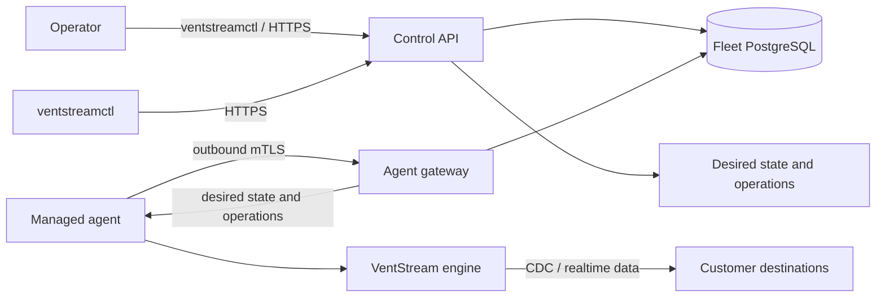

VentStream Fleet is the management plane for CDC and realtime engine workloads.
It inventories deployments, enrolls agents, distributes desired state and
configuration, records durable operations, and exposes organization-scoped audit
history.

Fleet never proxies source records, OpenSearch documents, NATS messages,
GraphQL events, or WebSocket traffic. An already-running engine continues its
cached state during a temporary control-plane outage.

## Administration surfaces

- `ventstreamctl` is the complete operational surface for environments,
  pipelines, deployments, enrollment, configuration, and operations.
- `ventstreamctl` also handles account onboarding, organization creation and
  selection, environments, and operational workflows through the public V1 API.
- Invitations, role bindings, service accounts, billing, settings, and audit
  queries are available through the V1 API but do not yet have CLI command groups.
- Helm or the customer's scheduler creates workloads. Fleet administers them
  after enrollment; it is not a general-purpose Kubernetes provisioner.

## Deployment choices

Open-core engines can run standalone from local configuration with no Fleet
dependency. Managed deployments run the Fleet supervisor as PID 1, which starts
and stops the engine child according to persisted desired state.

Standalone engines are operated through their process manager, Kubernetes, or
another scheduler. They cannot be paused, resumed, configured, or inspected with
`ventstreamctl` because they are not enrolled in Fleet.

Fleet itself may be hosted by VentStream or self-hosted. In both cases, engines
initiate outbound connections to the agent gateway; Fleet does not require inbound
access to source databases or engine data ports.
