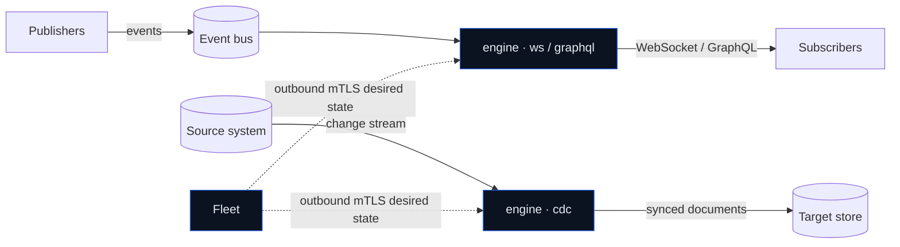

VentStream is a **data-streaming engine**. It moves data from where it
changes to where it's needed — continuously, in real time — through two
complementary pipelines that run on one binary:

- **Capture & denormalize** — read a system's native change stream and
  keep a derived, denormalized view continuously in sync in a target
  store. You declare the shape of the document you want; the engine
  maintains it for every record, forever, reacting to each change as it
  happens.
- **Real-time data delivery** — publish domain events once and stream
  them to any number of subscribers (browsers, services) in real time
  over WebSocket or GraphQL subscriptions, without each application
  building its own socket plumbing.

Both pipelines are the same idea — turn a stream of changes into the
exact shape a consumer needs. The difference is how you consume it: a
**queryable derived view** you read from a store (capture), or a **live
event stream** you subscribe to (delivery). Run either, or both,
selected by role.

<Info>
**Supported today.** VentStream is source / sink / transport-pluggable;
these are the first implemented backends, and more are planned:

- **Capture sources:** PostgreSQL logical replication, Neo4j CDC, MongoDB change
  streams, MySQL/MariaDB row binlog, and Kafka/Redpanda topics
- **Target stores:** OpenSearch / Elasticsearch
- **Real-time bus:** NATS (JetStream)

The rest of these docs use those backends in examples, but the concepts
are backend-agnostic.
</Info>

## The problems it solves

**Derived data drifts.** The moment you copy data into a search index,
cache, or read model, it starts going stale. The usual fixes are each
bad in their own way:

- **Periodic re-sync jobs** re-scan everything on a timer — minutes to
  hours behind, expensive, and they still miss anything that changed
  mid-run.
- **Application dual-writes** couple every write path to the derived
  store and rot the moment one path forgets to update it.
- **Hand-rolled triggers** become an unmaintainable web of per-table
  glue as the projection grows.

**Real-time delivery is plumbing.** Pushing live updates to clients
means every team re-implements the same WebSocket delivery, subscription
lifecycle, reconnect, and backpressure handling — usually subtly wrong.

VentStream replaces both with one declarative model and a streaming
engine: a change reaches its destination in **roughly a second**, and
only the affected data is recomputed or delivered.

## What makes it different

<CardGroup cols={2}>
  <Card title="Direct native CDC" icon="feather">
    For database sources, one binary reads the source's native change stream
    directly and writes to the target. Kafka/Redpanda is also supported when it
    is already your event backbone. No separate stream processor is required for
    projection and denormalization.
  </Card>
  <Card title="Joins & field selection, built in" icon="object-group">
    Most CDC tools emit raw per-table row changes — you bolt on a stream
    processor (Kafka Streams, Flink, ksqlDB) to embed related rows and
    pick fields. VentStream does the projection **inline**: embed related
    records, select columns, walk multiple hops — declared in YAML, with
    bounded fan-out so a change recomputes only what depends on it.
  </Card>
  <Card title="One job: move and reshape data" icon="bullseye">
    The engine streams and reshapes data — nothing else. It isn't an app
    server, a broker, or a database. A focused, single-responsibility
    component you can actually reason about and trust on the hot path.
  </Card>
  <Card title="Single box or distributed — same model" icon="network-wired">
    Run one agent on one server or a fleet behind a router; the model
    doesn't change. The GraphQL gateway composes into a federated router
    (Apollo / Cosmo), so it drops into a distributed graph as cleanly as
    it runs standalone.
  </Card>
  <Card title="Real-time WebSockets, done right" icon="tower-broadcast">
    A fast, efficient WebSocket + GraphQL-subscription path for
    server-to-server and server-to-client streaming — with subscription
    lifecycle, reconnect, backpressure, and consumer cleanup handled, so
    you don't re-implement socket plumbing per app.
  </Card>
  <Card title="Crash-safe by construction" icon="shield-check">
    The source cursor only advances once the sink confirms the write, so
    a restart resumes exactly where it left off — no silently dropped or
    duplicated changes.
  </Card>
</CardGroup>

## How it fits together

Two planes, deployed independently:

- **Data plane** — engine processes. Each runs one or more
  **roles**: `cdc` (capture & denormalize), `ws` / `graphql` (live
  fan-out). An engine reads its input stream and does its work entirely
  in the customer data plane.
- **Fleet management plane** — an API, CLI, gateway, and metadata
  store. Managed supervisors connect outbound with renewable mTLS identity,
  reconcile revisioned desired state, and report bounded status. Fleet never
  touches source systems or data traffic.

See [Architecture](/concepts/architecture) for the full picture.

## Where to go next

<CardGroup cols={2}>
  <Card title="Quickstart" icon="rocket" href="/quickstart">
    A running capture pipeline — source change to synced document — in
    minutes.
  </Card>
  <Card title="Real-time subscriptions" icon="bolt" href="/concepts/real-time-subscriptions">
    Fan live events out to clients over WebSocket or GraphQL.
  </Card>
  <Card title="Concepts" icon="book" href="/concepts/cdc-and-projections">
    How capture, projections, and the fan-out engine actually work.
  </Card>
  <Card title="Deploy" icon="server" href="/deploy/local">
    Run locally with Docker Compose, or ship the stack to Kubernetes.
  </Card>
</CardGroup>
